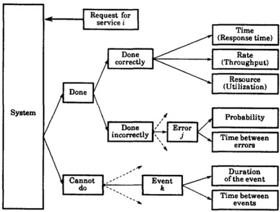
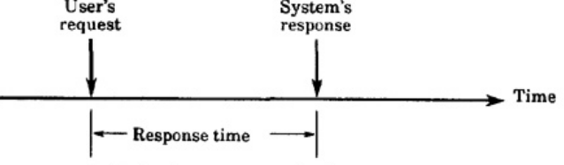
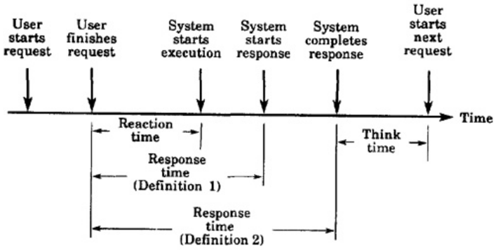
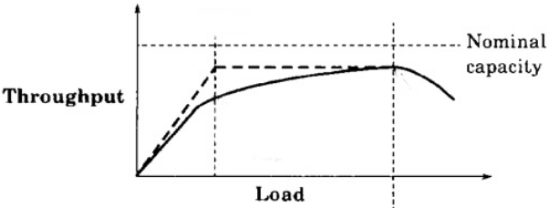
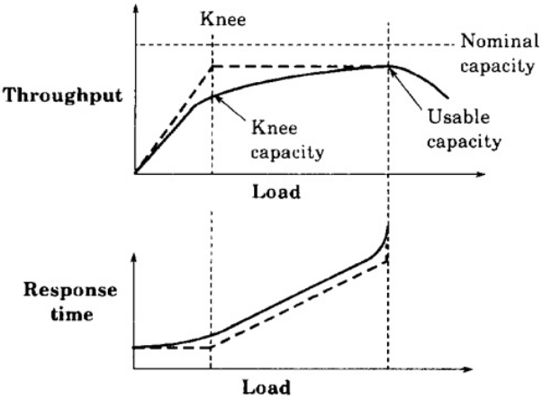

# -*- coding: utf-8 -*-
# -*- mode: org -*-
#+startup: beamer overview indent
#+LANGUAGE: pt-br
#+TAGS: noexport(n)
#+EXPORT_EXCLUDE_TAGS: noexport
#+EXPORT_SELECT_TAGS: export

#+Title: Análise de Desempenho de Sist. Comp.
#+SubTitle: Seleção de Métricas de Desempenho
#+Author: Prof. Lucas Mello Schnorr
#+Date: \copyleft

#+LaTeX_CLASS: beamer
#+LaTeX_CLASS_OPTIONS: [xcolor=dvipsnames,10pt]
#+OPTIONS: H:1 num:t toc:nil \n:nil @:t ::t |:t ^:t -:t f:t *:t <:t
#+LATEX_HEADER: \input{org-babel.tex}

* Selecionando Métricas de Desempenho

Existem três resultados possíveis
1. O sistema pode executar o serviço corretamente (Feito corretamente)
2. O sistema pode executar o serviço incorretamente (Feito incorretamente)
3. O sistema pode recusar-se a executar o serviço (Não consegue fazer)

#+attr_latex: :center no :width .7\linewidth

* Exemplo de resultados de serviço

- Gateway de rede:
  - Correto: encaminha pacotes ao destino
  - Incorreto: encaminha ao destino errado
  - Recusa: falha (fora do ar), sem encaminhamento

#+latex: \vfill\pause

- Banco de dados:
  - Correto: consulta respondida corretamente
  - Incorreto: consulta respondida incorretamente
  - Recusa: sem resposta (sistema fora do ar)

* Resultado: /feito corretamente/

- Três métricas principais (tempo–taxa–recurso):
  - **Responsividade** → tempo gasto (ex.: tempo de resposta)
  - **Produtividade** → taxa alcançada (ex.: vazão)
  - **Utilização** → utilização de recursos (% ocupado)

#+latex: \vfill\pause

- Gargalo: recurso com maior utilização
- Otimizar gargalos gera o maior retorno

* Resultado: /feito incorretamente/

Quando o serviço é executado incorretamente → erros

#+begin_center
Classificar tipos de erros e calcular probabilidades
#+end_center

#+latex: \vfill\pause

Exemplo: erros em gateway
- Erros de bit único
- Erros de múltiplos bits
- Entrega parcial (fragmentos)

* Resultado: /não consegue fazer/

Se o serviço não for executado → sistema está fora do ar/indisponível

#+begin_center
Classificar modos de falha e calcular probabilidades
#+end_center

#+latex: \vfill\pause

Exemplo: indisponibilidade de gateway
- 0,01% por falha de processador
- 0,03% por falha de software

* Resumo dos resultados

#+attr_latex: :center no :width .4\linewidth

- Serviço bem-sucedido → **métricas de velocidade**
- Serviço incorreto → **métricas de confiabilidade**
- Serviço indisponível → **métricas de disponibilidade**

#+latex: \vfill

#+begin_center
Cada serviço pode gerar muitas métricas nessas categorias

O número de métricas cresce à medida que cada sistema pode servir muitos serviços
#+end_center

#+latex: \vfill\pause

Vamos aprofundar três considerações significativas
- variabilidade e médias
- métricas individuais vs. globais
- lista de critérios importantes

* Consideração: variabilidade e médias

- Valores médios frequentemente suficientes, mas a variabilidade importa
  - A variabilidade pode indicar competição intricada por recursos

#+latex: \vfill
  
- Exemplos
  1. Alto tempo médio de resposta _e_ alta variabilidade do tempo de resposta
     - Ambos degradam a produtividade do usuário
  2. Aumentar o número de threads em uma máquina com poucos núcleos
     - O escalonamento torna-se complexo, maior competição \to maior variabilidade

#+latex: \vfill\pause

#+begin_center
Estudar tanto a média quanto a variabilidade quando necessário
#+end_center

* Consideração: métricas individuais vs. globais

- **Métricas individuais** → utilidade para cada usuário
- **Métricas globais** → utilidade em todo o sistema
- Exemplos
  - Individual: tempo de resposta, vazão
  - Global: utilização, confiabilidade, disponibilidade
- Trade-offs podem existir
  - Aumentar a vazão de um usuário pode reduzir a de outro

* Consideração: critérios para seleção de métricas

- *Baixa variabilidade*: reduz repetições necessárias para confiança
- *Não redundância*: evitar métricas que fornecem a mesma informação
  - Exemplo: comprimento da fila vs. tempo de espera
- *Completude*: todos os resultados devem estar refletidos nas métricas de desempenho

#+latex: \vfill\pause

Exemplo (para completude): ao comparar dois protocolos de rede
- Métrica principal de desempenho: aquele que fornece maior vazão
- O melhor protocolo causou mais desconexões prematuras
- Ação: ``probabilidade de desconexão'' adicionada como métrica de desempenho
      
* Métricas de Desempenho Comumente Utilizadas

Vejamos alguns exemplos de métricas de desempenho comumente utilizadas
- Nada está escrito em pedra, adaptações podem ser necessárias

#+latex: \vfill\pause

** Métricas típicas orientadas à tecnologia                        :B_block:
:PROPERTIES:
:BEAMER_env: block
:END:
Serviço bem-sucedido (/Feito corretamente/)
- Responsividade (Tempo de resposta, Tempo de retorno, Tempo de reação e Fator de esticamento)
- Produtividade (Vazão, Capacidade, Eficiência)
- Utilização (Tempo de ocupação do recurso, Identificação de gargalos)

#+latex: \pause

Serviço incorreto (/Feito incorretamente/)
- Confiabilidade (Probabilidade de erro, Classificação de erros, Tempo Médio Entre Erros)

#+latex: \pause  
  
Sem serviço (/Não consegue fazer/)
- Disponibilidade (Tempo ativo, Tempo inativo, Tempo Médio até a Falha)

** Métricas orientadas a custo                                     :B_block:
:PROPERTIES:
:BEAMER_env: block
:END:
#+latex: \vfill

Produtividade
- Relação custo/desempenho (USD por algo, como em estudos de aquisição)
  - Frequente em serviços baseados em nuvem, aquisição de hardware

* Responsividade 1/2 (Tempo de Resposta)

#+begin_center
*Tempo de resposta: intervalo entre a requisição do usuário e a resposta do sistema*
#+end_center

Visão simplista do tempo de resposta: requisição e resposta instantâneas
#+attr_latex: :width .5\linewidth

#+latex: \vfill\pause

Uma visão mais realista do tempo de resposta
#+attr_latex: :width .55\linewidth

#+latex: \vfill\pause

A definição #2 é preferida se a preparação da resposta for longa
- Sistemas interativos: da última /interação/ → último /atualizado/ recebido
- Lote: o *tempo de retorno*: tempo do envio do job até sua conclusão
  
* Responsividade 2/2 (Tempo de Resposta)

Uma visão mais realista do tempo de resposta
#+attr_latex: :width .55\linewidth

Medidas relacionadas
- *Tempo de reação*: tempo do envio da requisição até o início de sua resposta
  - Pode exigir instrumentação adicional

#+latex: \pause\vfill

Intuição geral da experiência de vida de uma pessoa
- O tempo de resposta aumenta conforme a carga do sistema aumenta
  - Carga sobe \to tempo de resposta sobe
  - Indica que o tempo de resposta não deve ser analisado isoladamente
    - É necessário correlacionar com a carga do sistema

#+latex: \pause

- *Fator de esticamento*, calculado como a razão entre
  #+begin_center
  o tempo de resposta com dada carga / o tempo de resposta com carga mínima
  #+end_center

* Produtividade 1/3 (Vazão)

#+begin_center
*Vazão: a taxa na qual as requisições podem ser atendidas*
#+end_center

#+latex: {\scriptsize
Alguns exemplos: Requisições/seg (sistemas interativos), Jobs/seg (sistemas
em lote), MIPS (Milhões de instruções por segundo), MFLOPS (Milhões
de operações de ponto flutuante por segundo), pps ou bps (pacotes por
segundo, bits por segundo), TPS (transações por segundo), e outros...
#+latex: }

#+latex: \pause\vspace{.3cm}

A vazão do sistema aumenta com a carga do sistema
- Pode até diminuir (catástrofe) quando a carga se torna avassaladora
- Capacidade nominal: vazão máxima alcançável em condições ideais
#+attr_latex: :width .7\linewidth

* Produtividade 2/3 (Vazão)

A vazão máxima pode levar a um *tempo de resposta inaceitável*
- Isso leva a duas definições
#+attr_latex: :width .6\linewidth

#+latex: \vfill\pause

Capacidade do joelho: ponto de operação ótimo (vazão vs. tempo de resposta)
- Antes do joelho: tempo de resposta estável, vazão cresce com a carga
- Após o joelho: tempo de resposta aumenta rapidamente, ganho de vazão é pequeno

#+latex: \pause
  
Capacidade utilizável: vazão máxima respeitando um dado tempo de resposta

* Produtividade 3/3 (Vazão)

Podemos combinar as capacidades Nominal e Utilizável
- *Eficiência* é a razão entre elas
Em redes de computadores, TCP tipicamente atinge 85% de eficiência.

#+latex: \vfill

Vamos experimentar usando =iperf3= em uma rede de 10Gbps.

Inicie um servidor com =iperf3 -s=, depois um cliente com
#+begin_src bash
iperf3 -l 65507 -u -b 10G -c <endereço_servidor> # UDP
iperf3 -c <endereço_servidor> # TCP
#+end_src

#+latex: \vfill\pause

Eficiência para sistemas multiprocessados é uma história à parte
- Lei de Amdahl (escalonamento forte)
- Lei de Ferguson (escalonamento fraco)

* Utilização de Recursos
** Definição
- Utilização = fração do tempo que um recurso está *ocupado fazendo algo*
  - Fórmula: Utilização = Tempo Ocupado / Tempo Total
- Tempo ocioso = período durante o qual um recurso *não é utilizado*

#+latex: \pause

** Considerações
- Objetivo: **balancear a carga** entre os recursos
  - Evitar sobrecarregar um único recurso
  - Frequentemente não totalmente alcançável, heurísticas são necessárias
- Veja o Scheduling Zoo https://schedulingzoo.lip6.fr/
  - Notação sujeita a https://en.wikipedia.org/wiki/Optimal_job_scheduling

#+latex: \pause

** Tipos de Recursos
- Processadores: ocupado ou ocioso (realmente?) → razão entre tempo ocupado/total
- Memória: parcialmente utilizada → medir *fração média utilizada* no intervalo

* Métricas de /Feito Incorretamente/ e /Não Consegue Fazer/
** Confiabilidade
- Probabilidade de erros
- Tempo Médio Entre Erros (TMEE)
- Frequentemente expresso como **segundos sem erros**

#+latex: \pause

** Disponibilidade
- Fração do tempo em que o sistema está disponível
- Tempo inativo vs. Tempo ativo
- **TMTF** = Tempo Médio até a Falha (tempo médio ativo)
  - Esta é uma métrica melhor se o tempo ativo for menor que o tempo de serviço
- Você ``sente'' alta disponibilidade, mas não consegue obter nenhum serviço (um paradoxo)

* Classificação por utilidade das métricas de desempenho

Maior é Melhor (MM)
- Valores de métricas preferidos são *maiores*
- Exemplo: *Vazão do sistema*

#+latex: \vfill\pause

Menor é Melhor (MeM)
- Valores de métricas preferidos são *menores*
- Exemplo: *Tempo de resposta*

#+latex: \vfill\pause

Nominal é o Melhor (NM)
- Valores *muito altos* e *muito baixos* são indesejáveis
- Exemplo: *Utilização*
  - Muito alta → tempos de resposta aumentam (ruim para usuários)
  - Muito baixa → recursos subutilizados (ruim para gestores)
  - Faixa ótima frequentemente *50–75%*

#+latex: \pause

#+begin_center
Este exemplo é discutível, pois a utilização pode ser MM em alguns casos

como no processamento paralelo limitado por computação
#+end_center

* Referências

#+latex: {\small
- Capítulo 3, Seções 3.2 a 3.4. Jain, Raj. The art of computer
  systems performance analysis: techniques for experimental design,
  measurement, simulation, and modeling. New York: John Wiley,
  c1991. ISBN 0471503363.
- Scheduling Zoo http://schedulingzoo.lip6.fr/ é uma bibliografia sobre
  alguns problemas de escalonamento. Os contribuidores são Peter Brucker, Sven
  Jäger, Christoph Dürr, Sigrid Knust, Damien Prot, Rob van Stee,
  Óscar C. Vásquez. A primeira versão deste site esteve online desde
  julho de 2006. Uma atualização séria foi feita em janeiro de 2016. Desde fevereiro
  de 2023 o projeto "Scheduling Zoo" está hospedado no GitHub, facilitando
  a contribuição da comunidade de escalonamento.
  https://sites.google.com/a/usach.cl/oscar-cvasquez/scheduling-zoo?authuser=0
- iPerf3 é uma ferramenta para medições ativas da largura de banda máxima
  alcançável em redes IP. Suporta ajuste de vários parâmetros
  relacionados a temporização, buffers e protocolos (TCP, UDP, SCTP com IPv4
  e IPv6). Para cada teste, reporta a largura de banda, perda e outros
  parâmetros. Esta é uma nova implementação que não compartilha código com
  o iPerf original e também não é retrocompatível. O iPerf foi
  originalmente desenvolvido pelo NLANR/DAST. O iPerf3 é desenvolvido
  principalmente pelo ESnet / Lawrence Berkeley National Laboratory. É lançado
  sob uma licença BSD de três cláusulas. https://iperf.fr/
#+latex: }
