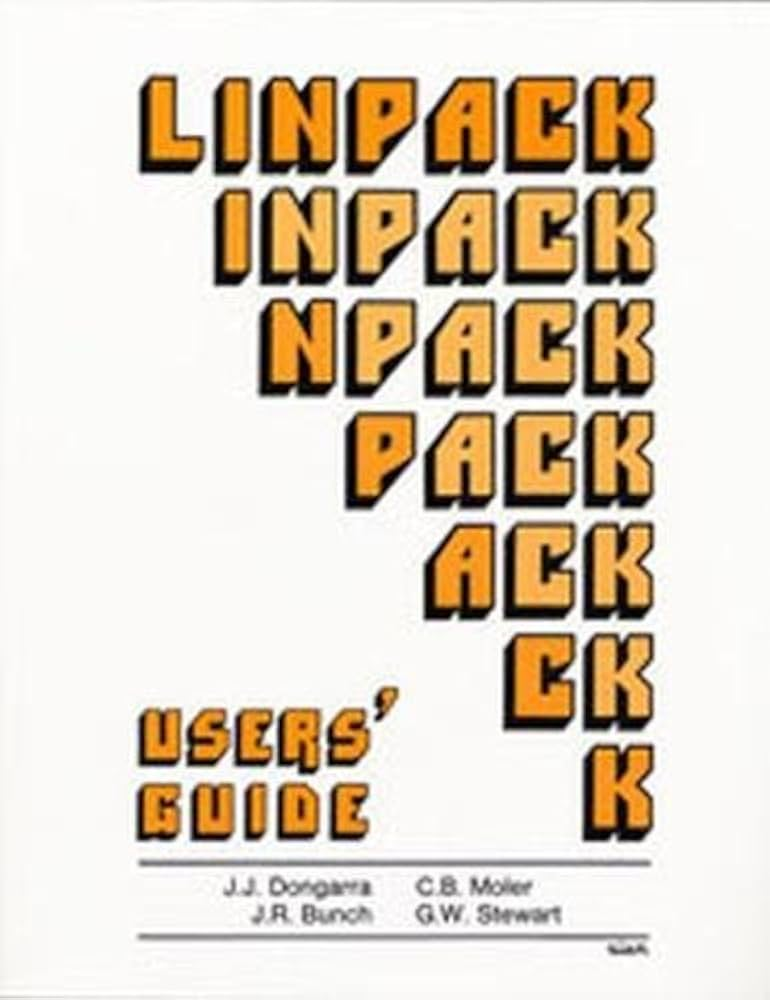
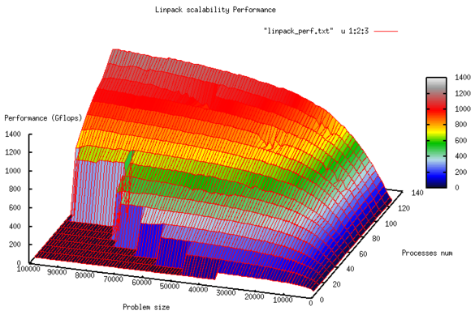
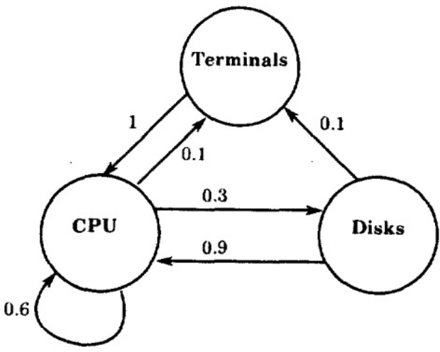
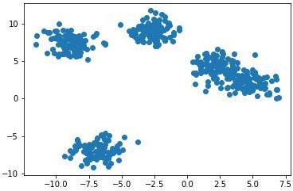

# -*- coding: utf-8 -*-
# -*- mode: org -*-
#+startup: beamer overview indent
#+LANGUAGE: pt-br
#+TAGS: noexport(n)
#+EXPORT_EXCLUDE_TAGS: noexport
#+EXPORT_SELECT_TAGS: export

#+Title: Comp. Syst. Perf. Analysis
#+SubTitle: Cargas de Trabalho
#+Author: Prof. Lucas Mello Schnorr
#+Date: \copyleft

#+LaTeX_CLASS: beamer
#+LaTeX_CLASS_OPTIONS: [xcolor=dvipsnames,10pt]
#+OPTIONS: H:1 num:t toc:nil \n:nil @:t ::t |:t ^:t -:t f:t *:t <:t
#+LATEX_HEADER: \input{org-babel.tex}

* Introdução às Técnicas e Ferramentas de Medição

A análise de desempenho envolve
- Monitorar o sistema enquanto ele é submetido a uma carga de trabalho

#+latex: \vfill\pause

É necessário compreender os seguintes tópicos
- Quais são os diferentes tipos de cargas de trabalho?
- Quais cargas de trabalho são comumente usadas por outros analistas?
- Como são selecionados os tipos apropriados de carga de trabalho?
- Como os dados de carga de trabalho medidos são resumidos?
- Como o desempenho do sistema é monitorado?
- Como uma carga de trabalho pode ser submetida ao sistema de forma controlada?
- Como os resultados da avaliação são apresentados?

* Cargas de Trabalho de Teste em Estudos de Desempenho

- Utilizadas para comparar sistemas computacionais  
  - Origem: principalmente para processadores e sistemas operacionais  
  - Pode ser generalizado para BDs, redes, etc.

#+latex: \vfill\pause

- *Carga de trabalho de teste*: qualquer carga de trabalho em estudos de desempenho  
  - Carga real: observada em produção, não repetível → inadequada  
  - Carga sintética: modelada com base na real, repetível, controlável

#+latex: \vfill\pause

** Tópicos dos grupos, quais são as cargas de trabalho?
***                                                                 :BMCOL:
:PROPERTIES:
:BEAMER_col: 0.45
:END:

#+latex: {\small
| Grupo  | Tópico         | Ni |
|--------+----------------+----|
| GrupoI | ESP32-C3       | GR |
| GrupoC | InferênciaGPU  | PG |
| GrupoD | Quantização    | GR |
| GrupoA | PadrãoComm     | PG |
| GrupoE | RecuperaçãoRAG | GR |
| GrupoJ | EnergiaLinux   | GR |
|--------+----------------+----|
#+latex: }

***                                                                  :BMCOL:
:PROPERTIES:
:BEAMER_col: 0.45
:END:

#+latex: {\small
| Grupo  | Tópico       |    |
|--------+--------------+----|
| GrupoK | BenchÁrvores | GR |
| GrupoF | Ordenação    | GR |
| GrupoM | MPCvsRL      | PG |
| GrupoL | Cripto       | PG |
| GrupoH | RPCS3        | GR |
|--------+--------------+----|
#+latex: }

* Por que Cargas de Trabalho Sintéticas?

- Representam cargas reais sem dados sensíveis ou volumosos  
- Fáceis de modificar e portar entre sistemas  
- Podem incluir ferramentas de medição embutidas

#+latex: \vfill\pause

Tipos de cargas de trabalho de teste:  
  1. Instrução de adição
     - Não mais utilizada em geral, mas semelhante às atuais /Operações de Ponto Flutuante/
  2. Misturas de instruções
     - Gibson Instruction Mix
  4. Kernels  
  5. Programas sintéticos  
  6. Benchmarks de aplicações  

* 2. Misturas de Instruções e o Gibson Mix

- A instrução de adição é insuficiente → necessidade de cargas detalhadas  
- *Mistura de Instruções*: conjunto de instruções + frequências de uso  
  - Permite calcular o tempo médio de instrução para comp. de processadores

#+latex: \vfill

- Gibson Mix (1959, IBM 704/650)
  - 13 classes de instruções (Load/Store, Desvios, Ops. em FLOAT, etc.)  
  - Média ponderada com base nas frequências de uso medidas

#+latex: {\tiny
| Classe | Tipo de Instrução                    | Frequência (%) |
|--------+--------------------------------------+----------------|
|      1 | Carga e Armazenamento                |           31,2 |
|      2 | Adição/Subtração em Ponto Fixo       |            6,1 |
|      3 | Comparações                          |            3,8 |
|      4 | Desvios                              |           16,6 |
|      5 | Adição/Subtração em Ponto Flutuante  |            6,9 |
|      6 | Multiplicação em Ponto Flutuante     |            3,8 |
|      7 | Divisão em Ponto Flutuante           |            1,5 |
|      8 | Multiplicação em Ponto Fixo          |            0,6 |
|      9 | Divisão em Ponto Fixo                |            0,2 |
|     10 | Deslocamento                         |            4,4 |
|     11 | Lógicas (AND, OR)                    |            1,6 |
|     12 | Instruções sem uso de registradores  |            5,3 |
|     13 | Indexação                            |           18,0 |
|--------+--------------------------------------+----------------|
#+latex: }

#+latex: \vfill\pause

Limitações
- CPUs modernas → instruções complexas, caches, pipelines, endereç.
- Tempos de instrução variam com padrões de dados e condições de hardware  
- Reflete apenas a velocidade da CPU, não o desempenho total do sistema  
Ainda útil: fornece um único número (MIPS / MFLOPS) para comparação relativa de CPUs  

* 3. Kernels como Cargas de Trabalho de Desempenho
Motivação
- Pipelining, caches, trad. de endereços \to /tempos de instrução variáveis/ @@latex:\linebreak@@
  Transl. Lookaside Buf. (TLB) _acerto_ /versus/ TLB _falta_ @@latex:\linebreak@@
  caminhamento de pg (_acerto_) \to falta de pg (_falta_)
- Avaliar instruções individuais deixa de ser representativo

#+latex: \vfill\pause

** Kernel                                                          :B_block:
:PROPERTIES:
:BEAMER_env: block
:END:
- Conjunto de instruções que representa uma função/serviço frequente.
- Exemplos: Multiplicação de Matrizes, Busca em Árvore, Inversão de Matriz, Ordenação

**                                                         :B_ignoreheading:
:PROPERTIES:
:BEAMER_env: ignoreheading
:END:

#+latex: \vfill\pause

Vantagens
- Capturam operações comuns de aplicações reais
- Menos afetados por parâmetros de baixo nível (ex.: frequência de zeros, desvios) @@latex: \pause@@
Limitações
- Frequentemente não são baseados em medições reais do sistema
- Tipicamente ignoram E/S → desempenho do kernel não reflete o desempenho total do sistema

* 4. Programas Sintéticos (Laços de Exercitação)
Motivação
- Kernels de processamento ignoravam serviços do SO e dispositivos de E/S
- Cargas reais envolvem E/S significativa

#+latex: \vfill\pause

** Programas Sintéticos                                            :B_block:
:PROPERTIES:
:BEAMER_env: block
:END:
- Laços simples que realizam chamadas de serviço ou requisições de E/S repetidas
- Parâmetros de controle ajustam o número de requisições
- Exemplo: =stress-ng=

**                                                         :B_ignoreheading:
:PROPERTIES:
:BEAMER_env: ignoreheading
:END:

#+latex: \vfill\pause

Vantagens
- Rápidos de desenvolver e portáveis entre sistemas

Desvantagens
- Muito pequenos; não representativos de referências reais a memória/disco
- Faltas de página, caches de disco e sobreposição CPU-E/S não são bem capturadas
- Inadequados para ambientes multiusuário (artefatos de sincronização)

* 5. Benchmarks de Aplicações
** Benchmarking                                                    :B_block:
:PROPERTIES:
:BEAMER_env: block
:END:
Comparar o desempenho de dois ou mais sistemas por meio de medições

#+latex: \pause

** Benchmarks                                                      :B_block:
:PROPERTIES:
:BEAMER_env: block
:END:
- Cargas de trabalho usadas em benchmarking
- Podem incluir kernels, programas sintéticos e cargas em nível de aplicação
- Às vezes restritos a programas extraídos de cargas reais @@latex: \linebreak@@
  https://www.spec.org/ @@latex: \linebreak@@ \to Products \to CPU \to SPEC CPU 2017 \to Benchmarks
  
#+latex: \pause
  
** Benchmarks de Aplicações                                        :B_block:
:PROPERTIES:
:BEAMER_env: block
:END:
- Representam um subconjunto de funções reais de aplicações (ex.: reservas aéreas)
  - Utilizam quase todos os recursos do sistema: CPU, E/S, redes, bancos de dados

* 1º Exemplo: O Benchmark LINPACK

#+begin_center
https://top500.org/project/linpack/

http://www.netlib.org/benchmark/hpl/
#+end_center

Desenvolvido por Jack Dongarra (1983), Innovative Computing Laboratory

#+latex: \smallskip

Características: Distribuição de dados em bloco cíclico bidimensional;
Variante com visão à direita da fatoração LU com pivoteamento parcial por linha,
com múltiplos níveis de look-ahead; Fatoração recursiva de painel com busca de pivô
e broadcast de coluna combinados; Diversas topologias virtuais de broadcast de painel;
Algoritmo de swap-broadcast com redução de largura de banda; Substituição regressiva
com look-ahead de profundidade 1.

**                                                                   :BMCOL:
:PROPERTIES:
:BEAMER_col: 0.3
:END:

#+attr_latex: :width .8\linewidth

**                                                                   :BMCOL:
:PROPERTIES:
:BEAMER_col: 0.7
:END:
#+attr_latex: :width .8\linewidth

* 2º Exemplo: Suíte de Benchmark SPEC CPU2017

Avalia o desempenho computacionalmente intensivo de processadores, memória e compiladores.

#+latex: \vfill\pause

43 Benchmarks: Divididos em quatro sub-suítes.
- SPECspeed 2017 Integer
- SPECspeed 2017 Floating Point
- SPECrate 2017 Integer
- SPECrate 2017 Floating Point
- Linguagens: C99, Fortran-2003, C++2003.
- Métricas: Desempenho medido em SPECspeed e SPECrate.

Características Principais
- Aplicações do Mundo Real: Benchmarks derivados de aplicações reais de usuários
- Portabilidade: Projetado para executar em uma ampla variedade de sistemas
- Medição de Energia: Métrica opcional para medir o consumo de energia

#+latex: \vfill\pause
/Mas é necessário pagar..../

* ``A Arte da Seleção de Carga de Trabalho''

#+begin_center
A carga de trabalho é crucial para a avaliação de desempenho.

Uma seleção inadequada pode levar a conclusões equivocadas.

@@latex: \bigskip@@

Sistema Sob Teste /versus/ Componente em Estudo
#+end_center

#+latex: \vfill\pause

Considerações Principais
1. Serviços Exercitados: a carga de trabalho deve estressar todos os serviços-chave, não apenas um componente
2. Nível de Detalhe: Escolha um nível de abstração adequado ao sistema
3. Representatividade: Reflita os padrões de uso do mundo real
4. Atualidade: Use cargas de trabalho recentes e relevantes

#+latex: \vfill\pause

Exemplos
- Comparação de CPU: instruções com uso intensivo de CPU como carga de trabalho.
- Comparação de sistema de banco de dados: transações como carga de trabalho.
- Múltiplos serviços: a carga de trabalho deve exercitar todos os serviços

* Técnicas de Caracterização de Carga de Trabalho

#+begin_center
Motivação

um ambiente real de usuários geralmente não é repetível.
#+end_center

#+latex: \pause

#+begin_center
Objetivo

Criar um modelo de carga de trabalho repetível para testar

múltiplas alternativas em condições idênticas
#+end_center

#+latex: \pause\vfill

*Processo metodológico*
1. Observar ambientes reais de usuários
2. Identificar características-chave
3. Desenvolver um modelo para estudos controlados e repetíveis

#+latex: \pause

** Tópicos dos grupos, quais são as cargas de trabalho?
***                                                                 :BMCOL:
:PROPERTIES:
:BEAMER_col: 0.45
:END:

#+latex: {\small
| Grupo  | Tópico         | Ni |
|--------+----------------+----|
| GrupoI | ESP32-C3       | GR |
| GrupoC | InferênciaGPU  | PG |
| GrupoD | Quantização    | GR |
| GrupoA | PadrãoComm     | PG |
| GrupoE | RecuperaçãoRAG | GR |
| GrupoJ | EnergiaLinux   | GR |
|--------+----------------+----|
#+latex: }

***                                                                  :BMCOL:
:PROPERTIES:
:BEAMER_col: 0.45
:END:

#+latex: {\small
| Grupo  | Tópico       |    |
|--------+--------------+----|
| GrupoK | BenchÁrvores | GR |
| GrupoF | Ordenação    | GR |
| GrupoM | MPCvsRL      | PG |
| GrupoL | Cripto       | PG |
| GrupoH | RPCS3        | GR |
|--------+--------------+----|
#+latex: }

* Componentes da Carga de Trabalho

#+begin_center
Consiste nos serviços requisitados ou demandas de recursos

pelos usuários no sistema observado
#+end_center

#+latex: \vfill\pause
  
Definição de Usuário
- Entidade que faz requisições de serviço na interface do sistema observado
- Pode ser humano ou não-humano (ex.: programas, jobs em lote)
  - Hoje, tipicamente não-humano, mas ainda existem (jogos, etc.)

Exemplos de _Componentes da Carga de Trabalho_
1. Aplicações: diferentes tipos de aplicações / jobs
2. Locais: origem das requisições, diferentes localizações de uma organização
3. Sessões de Usuário: do login ao logout, aplicações utilizadas

#+latex: \pause

** Tópicos dos grupos, quais são as cargas de trabalho?
***                                                                 :BMCOL:
:PROPERTIES:
:BEAMER_col: 0.45
:END:

#+latex: {\small
| Grupo  | Tópico         | Ni |
|--------+----------------+----|
| GrupoI | ESP32-C3       | GR |
| GrupoC | InferênciaGPU  | PG |
| GrupoD | Quantização    | GR |
| GrupoA | PadrãoComm     | PG |
| GrupoE | RecuperaçãoRAG | GR |
| GrupoJ | EnergiaLinux   | GR |
|--------+----------------+----|
#+latex: }

***                                                                  :BMCOL:
:PROPERTIES:
:BEAMER_col: 0.45
:END:

#+latex: {\small
| Grupo  | Tópico       |    |
|--------+--------------+----|
| GrupoK | BenchÁrvores | GR |
| GrupoF | Ordenação    | GR |
| GrupoM | MPCvsRL      | PG |
| GrupoL | Cripto       | PG |
| GrupoH | RPCS3        | GR |
|--------+--------------+----|
#+latex: }

* Considerações Principais para Seleção de Componentes da Carga de Trabalho

1. Os componentes da carga de trabalho devem estar na interface do sistema
2. Cada componente deve representar um grupo tão homogêneo quanto possível
   - Não misture grupos diferentes
3. Defina os /parâmetros da carga de trabalho/
   - Quantidades medidas, requisições de serviço ou demandas de recursos
   - Exemplos: tipos de transação, instruções, tamanhos de pacote, etc.
4. Prefira usar parâmetros que dependam da carga de trabalho
   - Escolha: +tempo decorrido (tempo de resposta)+, escolha \to número de requisições de serviço
   - Escolha: +tempo de processamento da CPU+, escolha \to o tamanho da mensagem
5. Selecione características da carga de trabalho com impacto significativo no desempenho do sistema

* Técnicas para Caracterização de Carga de Trabalho

1. Média
2. Especificação da dispersão
3. Histogramas de parâmetro único
4. Histogramas multiparâmetro
5. Análise de Componentes Principais
6. Modelos de Markov
7. Agrupamento (Clustering)

* 1. Média

#+begin_center
um único número que resume os valores do parâmetro observados
#+end_center

#+latex: \vfill

#+begin_export latex
\[
\bar{x} = \frac{1}{n} \sum_{i=1}^{n} x_i
\]
#+end_export

#+latex: \vfill\pause

** Alternativas à Média Aritmética                                 :B_block:
:PROPERTIES:
:BEAMER_env: block
:END:
- A média pode ser inadequada em alguns casos
- Use mediana, moda, média geométrica ou média harmônica
- A moda é mais adequada para parâmetros categóricos
  - Exemplo: destino de pacote mais frequente (A, B, C)
  - Se as frequências forem similares, considere top-2, top-3 ou top-n valores
- Detalhes e condições discutidos em Jain/Capítulo 12 (veremos em breve)

* 2. Especificação da Dispersão 1/2

#+begin_center
A média oculta muita informação quando há variabilidade em jogo

Portanto, a variabilidade é comumente especificada pela variância
#+end_center

#+begin_export latex
\[
s^2 = \frac{1}{n-1} \sum_{i=1}^{n} (x_i - \bar{x})^2
\]
#+end_export

O desvio padrão (s) pode ser mais significativo
- Expresso nas mesmas unidades que a média

Alternativas
- Amplitude (mínimo e máximo)
- Percentis 10 e 90
- Amplitude semi-interquartil
- Desvio absoluto médio
- Veja a Seção 12.8 para detalhes e casos de uso apropriados

* 2. Especificação da Dispersão 2/2

** Esquerda                                                          :BMCOL:
:PROPERTIES:
:BEAMER_col: 0.7
:END:
#+begin_center
A razão entre o desvio padrão e a média \\
Coeficiente de Variação (C.V.)
#+end_center

** Direita                                                           :BMCOL:
:PROPERTIES:
:BEAMER_col: 0.3
:END:
#+begin_export latex
\[ COV = \left( \frac{\sigma}{\mu} \right) \times 100\% \]
#+end_export

#+latex: \pause

** Caract. da Carga com *muitos programas diferentes*

- C.V. alto: alta variância → a média é insuficiente :(
  - Considere o histograma completo
  - Agrupe os usuários em classes e calcule a média dentro de grupos similares

#+latex: {\tiny
| Dado                         | Média        | Coeficiente de Variação |
|------------------------------+--------------+-------------------------|
| Tempo de CPU (VAX-11/780)    | 2,19 segundos |                   40,23 |
| Número de escritas diretas   | 8,20         |                   53,59 |
| Bytes de escrita direta      | 10,21 kbytes |                   82,41 |
| Número de leituras diretas   | 22,64        |                   25,65 |
| Bytes de leitura direta      | 49,70 kbytes |                   21,01 |
#+latex: }

#+latex: \pause

** Caract. da Carga com *mesmo tipo de programas*

- C.V. zero: variância zero → o parâmetro é constante
  - A média é tudo que você precisa (informação completa)

#+latex: {\tiny
| Dado                         | Média        | Coeficiente de Variação |
|------------------------------+--------------+-------------------------|
| Tempo de CPU (VAX-11/780)    | 2,57 segundos |                    3,54 |
| Número de escritas diretas   | 19,74        |                    4,33 |
| Bytes de escrita direta      | 13,46 kbytes |                    3,87 |
| Número de leituras diretas   | 37,77        |                    3,73 |
| Bytes de leitura direta      | 36,93 kbytes |                    3,16 |
#+latex: }

* 3. Histogramas de Parâmetro Único ou 4. Multiparâmetro

#+begin_center
Mostram as frequências relativas dos valores dos parâmetros
#+end_center

Método
- Parâmetros contínuos → dividir o intervalo em buckets/células
- Contar observações por bucket → histograma (ex.: tempo de CPU, E/S em disco).

**                                                                   :BMCOL:
:PROPERTIES:
:BEAMER_col: 0.6
:END:

#+begin_src R :results output :session *R* :exports code :noweb yes :colnames yes
suppressMessages(library(tidyverse))
set.seed(0)
tibble(value =  rnorm(1000, mean = 15, sd = 4)) |>
  ggplot(aes(x = value)) + geom_histogram(bins = 30) -> plot
#+end_src

**                                                                   :BMCOL:
:PROPERTIES:
:BEAMER_col: 0.4
:END:

#+latex: \bigskip

#+attr_latex: :width .2\linewidth :center no
[[file:img/histogram.pdf]]

**                                                         :B_ignoreheading:
:PROPERTIES:
:BEAMER_env: ignoreheading
:END:

#+latex: \bigskip

Aplicações
  - Gerar carga de trabalho de teste para modelos de simulação ou medição
  - Ajustar e verificar distribuições de probabilidade em modelagem analítica
- Limitações
  - Histogramas de parâmetro único ignoram interações entre parâmetros
  - Solução: Use *histogramas multiparâmetro* para preservá-las

* 5. Análise de Componentes Principais (PCA)

#+begin_center
soma ponderada dos valores dos parâmetros

Usando a_j como peso para o j-ésimo parâmetro x_j, a soma ponderada y é
#+end_center

#+begin_export latex
\[
y = \sum_{j=1}^{n} a_j x_j
\]
#+end_export

Como definir os pesos?
- Podemos usar PCA \to permite encontrar os pesos a_i's

* 6. Modelos de Markov

A Matemática Estranha que Prevê (Quase) Tudo

https://www.youtube.com/watch?v=KZeIEiBrT_w

#+latex: \vfill\pause

#+begin_center
A próxima requisição ou estado do sistema depende apenas do estado atual

O sistema segue um modelo de Markov se o estado futuro depende apenas do estado presente

Útil em análise de filas e modelagem de carga de trabalho
#+end_center

#+latex: \vfill\pause

Descrito por uma **matriz de transição** com probabilidades de mudança de estado
| De/Para  | CPU | Disco | Terminal |
|----------+-----+-------+----------|
| CPU      | 0,6 |   0,3 |      0,1 |
| Disco    | 0,9 |     0 |      0,1 |
| Terminal |   1 |     0 |        0 |
O **diagrama de transição de estados** correspondente pode visualizar o modelo
#+attr_latex: :width .3\linewidth

* 7. Agrupamento (Clustering)

- Cargas de trabalho medidas de grande porte frequentemente contêm milhares de componentes
  - Objetivo: classificar os componentes em alguns clusters de comportamento similar

#+attr_latex: :width .4\linewidth

- Benefícios
  - Selecionar um representante de cada cluster
  - Reduz a complexidade

* Encerramento

#+begin_center
Como tudo isso se aplica ao seu próprio TF?
#+end_center

** Tópicos dos grupos, quais são as cargas de trabalho?
***                                                                 :BMCOL:
:PROPERTIES:
:BEAMER_col: 0.45
:END:

#+latex: {\small
| Grupo  | Tópico         | Ni |
|--------+----------------+----|
| GrupoI | ESP32-C3       | GR |
| GrupoC | InferênciaGPU  | PG |
| GrupoD | Quantização    | GR |
| GrupoA | PadrãoComm     | PG |
| GrupoE | RecuperaçãoRAG | GR |
| GrupoJ | EnergiaLinux   | GR |
|--------+----------------+----|
#+latex: }

***                                                                  :BMCOL:
:PROPERTIES:
:BEAMER_col: 0.45
:END:

#+latex: {\small
| Grupo  | Tópico       |    |
|--------+--------------+----|
| GrupoK | BenchÁrvores | GR |
| GrupoF | Ordenação    | GR |
| GrupoM | MPCvsRL      | PG |
| GrupoL | Cripto       | PG |
| GrupoH | RPCS3        | GR |
|--------+--------------+----|
#+latex: }

**                                                         :B_ignoreheading:
:PROPERTIES:
:BEAMER_env: ignoreheading
:END:

#+latex: \vfill\pause

Requisitos básicos
- Permitir experimentos repetíveis e controlados
- Representar cargas reais sem dados sensíveis ou volumosos

Tipos de cargas de trabalho
- Programas Sintéticos (laços de exercitação)
- Benchmarks de Aplicações (subconjuntos de aplicações reais)

* Referências

#+latex: {\small
- Capítulo 4 (Seções 4.1 a 4.6); Capítulo 5 (Seções 5.1 a 5.5);
  Capítulo 6 (Seções 6.1 até a introdução da 6.8). Jain, Raj. The art
  of computer systems performance analysis: techniques for
  experimental design, measurement, simulation, and modeling. New
  York: John Wiley, c1991. ISBN 0471503363.
- Estudo de escalabilidade: https://algowiki-project.org/en/Linpack,_HPL
- Guia do Usuário do Linpack: https://a.co/d/2xpLh4q
- Avaliação de Desempenho de Agrupamento no Scikit Learn
  https://www.geeksforgeeks.org/machine-learning/clustering-performance-evaluation-in-scikit-learn/
#+latex: }
